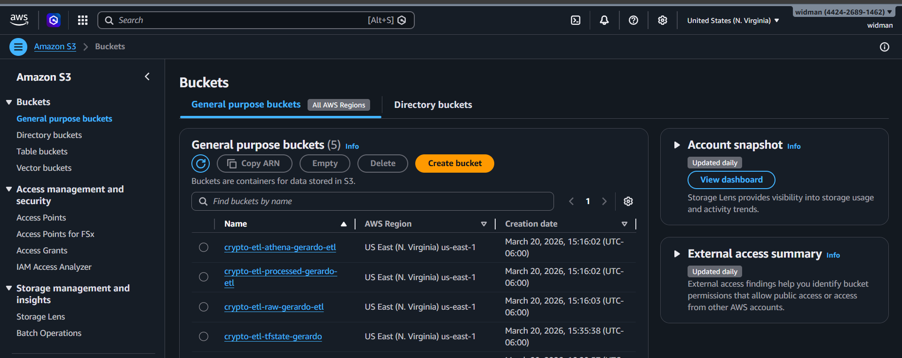
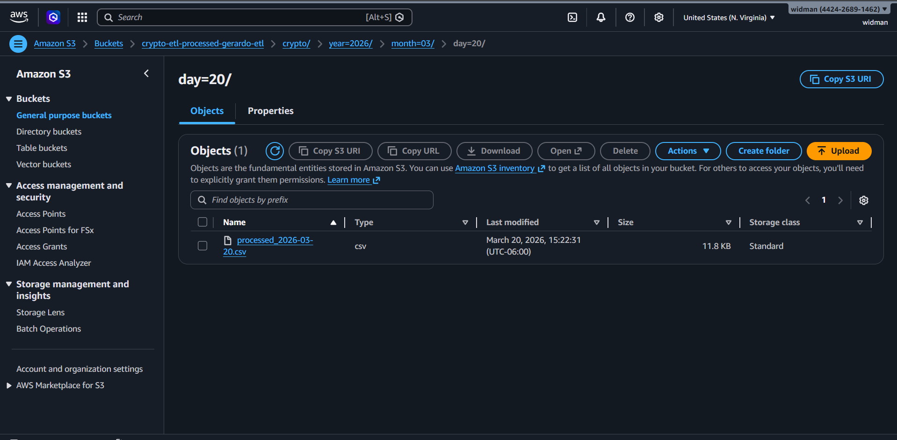
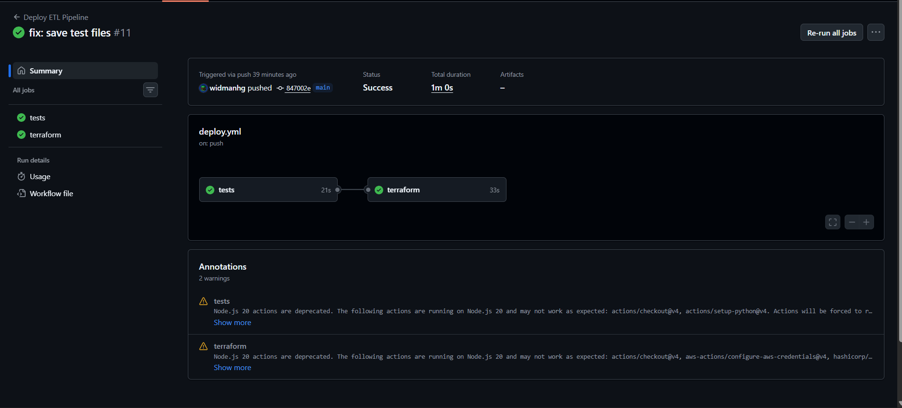
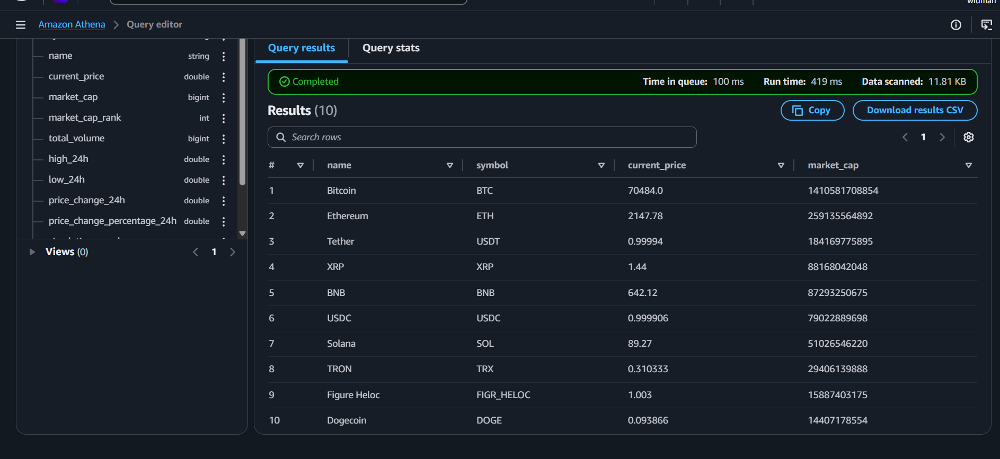

# 🚀 Crypto ETL Pipeline — AWS + Terraform


A production-ready serverless ETL pipeline built on AWS, provisioned with Terraform, and deployed automatically via GitHub Actions CI/CD.

The pipeline ingests real-time cryptocurrency market data daily from the CoinGecko API, stores it in a partitioned S3 data lake, and enables SQL analytics through Amazon Athena.

---

## 📐 Architecture

<!-- Pega aquí un screenshot de tu arquitectura o diagram -->
<!-- Recomendado: usa draw.io o excalidraw para hacer el diagrama -->
```
CoinGecko API
      │
      ▼
AWS Lambda (Python 3.11) ◄── EventBridge (rate: 1 day)
      │
      ├──► S3 Raw Bucket
      │    └── crypto/year=YYYY/month=MM/day=DD/raw_YYYY-MM-DD.json
      │
      └──► S3 Processed Bucket
           └── crypto/year=YYYY/month=MM/day=DD/processed_YYYY-MM-DD.csv
                         │
                         ▼
                  Amazon Athena
                  (SQL Analytics)

Infrastructure as Code: Terraform
CI/CD: GitHub Actions
```





---

## 🛠️ Tech Stack

| Layer | Technology |
|-------|-----------|
| Cloud | AWS |
| IaC | Terraform |
| Compute | AWS Lambda (Python 3.11) |
| Storage | Amazon S3 |
| Scheduler | Amazon EventBridge |
| Analytics | Amazon Athena |
| Monitoring | Amazon CloudWatch |
| CI/CD | GitHub Actions |
| Testing | pytest + moto |

---

## 📁 Project Structure
```
etl-terraform-aws/
├── terraform/
│   ├── main.tf           # Provider + backend config
│   ├── variables.tf      # Input variables
│   ├── s3.tf             # S3 buckets
│   ├── iam.tf            # IAM roles and policies
│   ├── lambda.tf         # Lambda function
│   ├── eventbridge.tf    # Scheduler
│   └── athena.tf         # Athena database + workgroup
├── lambda/
│   └── etl.py            # ETL logic (Extract, Transform, Load)
├── tests/
│   ├── unit/             # Unit tests (transform logic)
│   ├── integration/      # Integration tests (S3 with moto)
│   └── data_quality/     # Data quality validations
├── .github/
│   └── workflows/
│       └── deploy.yml    # CI/CD pipeline
└── requirements-dev.txt  # Test dependencies
```

---

## ⚙️ How It Works

### Extract
Lambda calls the CoinGecko public API and fetches the top 100 cryptocurrencies by market cap, including price, volume, market cap, and 24h change data.

### Transform
The raw data is cleaned and normalized:
- Symbols are uppercased
- Null values are handled gracefully
- Decimal values are rounded
- An ingestion date is added for partitioning

### Load
- **Raw JSON** is saved to S3 with date partitioning for full data lineage
- **Processed CSV** is saved to a separate S3 bucket, queryable via Athena

---

## 🏗️ Infrastructure

All AWS resources are provisioned with Terraform:

- **3 S3 Buckets** — raw data, processed data, Athena query results
- **1 Lambda Function** — ETL logic in Python 3.11
- **1 IAM Role + Policies** — least privilege access
- **1 EventBridge Rule** — daily schedule trigger
- **1 Athena Database + Workgroup** — SQL analytics layer
- **1 CloudWatch Log Group** — Lambda execution logs
- **Remote State** — tfstate stored in S3

---

## 🔄 CI/CD Pipeline

Every push to `main` triggers the GitHub Actions workflow:
```
Push to main
     │
     ▼
[Job 1: Tests]
  ├── Unit tests (pytest)
  ├── Integration tests (moto)
  └── Data quality checks
     │
     ▼ (only if all tests pass)
[Job 2: Terraform]
  ├── terraform init
  ├── terraform plan
  └── terraform apply
```



## 📊 Sample Athena Queries

**Top 10 by market cap:**
```sql
SELECT name, symbol, current_price, market_cap
FROM crypto_etl_db.crypto_prices
ORDER BY market_cap DESC
LIMIT 10;
```

**Biggest gainers in 24h:**
```sql
SELECT name, symbol, price_change_percentage_24h, current_price
FROM crypto_etl_db.crypto_prices
ORDER BY price_change_percentage_24h DESC
LIMIT 10;
```

**Bitcoin price over time:**
```sql
SELECT ingestion_date, current_price
FROM crypto_etl_db.crypto_prices
WHERE symbol = 'BTC'
ORDER BY ingestion_date;
```


---

## 🧪 Testing

The project includes 3 levels of testing:

**Unit tests** — validate the transform logic in isolation using mock data

**Integration tests** — validate S3 read/write operations using `moto` (AWS mock library), no real AWS calls needed

**Data quality tests** — validate business rules on the output data:
- No duplicate coin IDs
- All prices are positive
- High 24h > Low 24h
- Date format is YYYY-MM-DD
- No null values in critical fields
```bash
# Run all tests locally
pip install -r requirements-dev.txt
pytest tests/ -v
```

---

## 🚀 Deploy

### Prerequisites
- AWS account with IAM user
- Terraform >= 1.5.0
- AWS CLI configured

### Steps
```bash
# 1. Clone the repo
git clone https://github.com/widmanhg/etl-terraform-aws.git
cd etl-terraform-aws

# 2. Package the Lambda
cd lambda
zip etl.zip etl.py
cd ..

# 3. Deploy infrastructure
cd terraform
terraform init
terraform apply -var="bucket_suffix=your-suffix"

# 4. Test the Lambda manually
aws lambda invoke \
  --function-name crypto-etl-etl-function \
  --region us-east-1 \
  output.json && cat output.json
```

### GitHub Actions (automated)

Add these secrets to your GitHub repo:

| Secret | Description |
|--------|-------------|
| `AWS_ACCESS_KEY_ID` | AWS access key |
| `AWS_SECRET_ACCESS_KEY` | AWS secret key |
| `BUCKET_SUFFIX` | Unique suffix for S3 buckets |

Every push to `main` runs tests and deploys automatically.

---

## 💼 About

Built as a portfolio project to demonstrate:
- Data Engineering (ETL pipeline design)
- Cloud Infrastructure (AWS serverless)
- Infrastructure as Code (Terraform)
- CI/CD automation (GitHub Actions)
- Software quality (pytest, moto, data quality checks)

---
